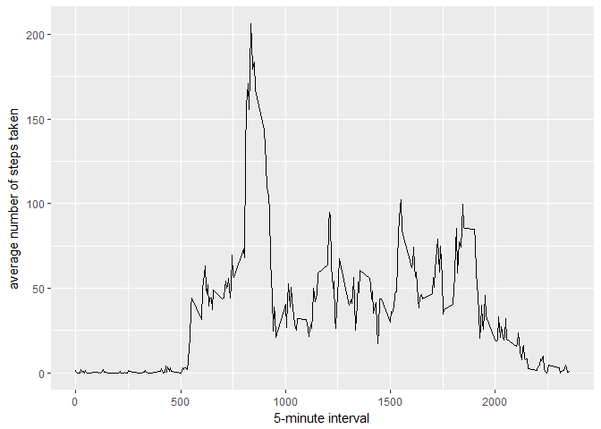

# Assignment
Danie Roelofse  
29 January 2017  


##Step 1: Reading in the data 

```r
setwd("C:\\Coursera\\Reproducible Research\\Week 2 Assignment")
  Raw_Data = read.csv("activity.csv")
```

##Step 2: Summarizing the data 


```r
total.steps <- tapply(Raw_Data$steps, Raw_Data$date, FUN = sum, na.rm = TRUE)
```

##Step 3: Drawing up the histogram


```r
library("ggplot2")
```

```
## Warning: package 'ggplot2' was built under R version 3.3.2
```

```r
qplot(total.steps, binwidth = 1000, xlab = "total number of steps taken each day")  
```

<!-- -->

##Step 4: What is the mean and the median for the Total steps taken every day?
###Firstly, let's look at the mean:

```r
#Mean
mean(total.steps,na.rm = TRUE)
```

```
## [1] 9354.23
```

###Secondly, the median

```r
#Median
median(total.steps,na.rm = TRUE)
```

```
## [1] 10395
```

##


```r
library(ggplot2)
averages <- aggregate(x = list(steps = Raw_Data$steps), by = list(interval = Raw_Data$interval), 
    FUN = mean, na.rm = TRUE)
ggplot(data = averages, aes(x = interval, y = steps)) + geom_line() + xlab("5-minute interval") + 
    ylab("average number of steps taken")
```

<!-- -->

###On average across all the days in the dataset, the 5-minute interval contains the maximum number of steps?


```r
  averages[which.max(averages$steps), ]
```

```
##     interval    steps
## 104      835 206.1698
```

###Inputing Missing values
Missing values will always be in your everyday datasets. Sometimes you don't have enough data to just remove them, so what then? I use the average


```r
library("ggplot2")
BlanksFunc <- function(steps, interval) {
    filled <- NA
    if (!is.na(steps)) 
        filled <- c(steps) else filled <- (averages[averages$interval == interval, "steps"])
    return(filled)
}
fillBlanks <- Raw_Data
fillBlanks$steps <- mapply(BlanksFunc, fillBlanks$steps, fillBlanks$interval)  


total.steps <- tapply(fillBlanks$steps, fillBlanks$date, FUN = sum)
qplot(total.steps, binwidth = 1000, xlab = "total number of steps taken each day")
```

<!-- -->


Let's check the mean and median now:


```r
mean(total.steps)
```

```
## [1] 10766.19
```

For the median:

```r
median(total.steps)
```

```
## [1] 10766.19
```

###Are there differences in activity patterns between weekdays and weekends?

First, let's find the day of the week for each measurement in the dataset. In this part, we use the dataset with the filled-in values.


```r
weekday.or.weekend <- function(date) {
    day <- weekdays(date)
    if (day %in% c("Monday", "Tuesday", "Wednesday", "Thursday", "Friday")) 
        return("weekday") else if (day %in% c("Saturday", "Sunday")) 
        return("weekend") else stop("invalid date")
}
fillBlanks$date <- as.Date(fillBlanks$date)
fillBlanks$day <- sapply(fillBlanks$date, FUN = weekday.or.weekend)
```

Now, let's make a panel plot containing plots of average number of steps taken on weekdays and weekends.


```r
library("ggplot2")
averages <- aggregate(steps ~ interval + day, data = fillBlanks, mean)
ggplot(averages, aes(interval, steps)) + geom_line() + facet_grid(day ~ .) + 
    xlab("5-minute interval") + ylab("Number of steps")
```

<!-- -->


